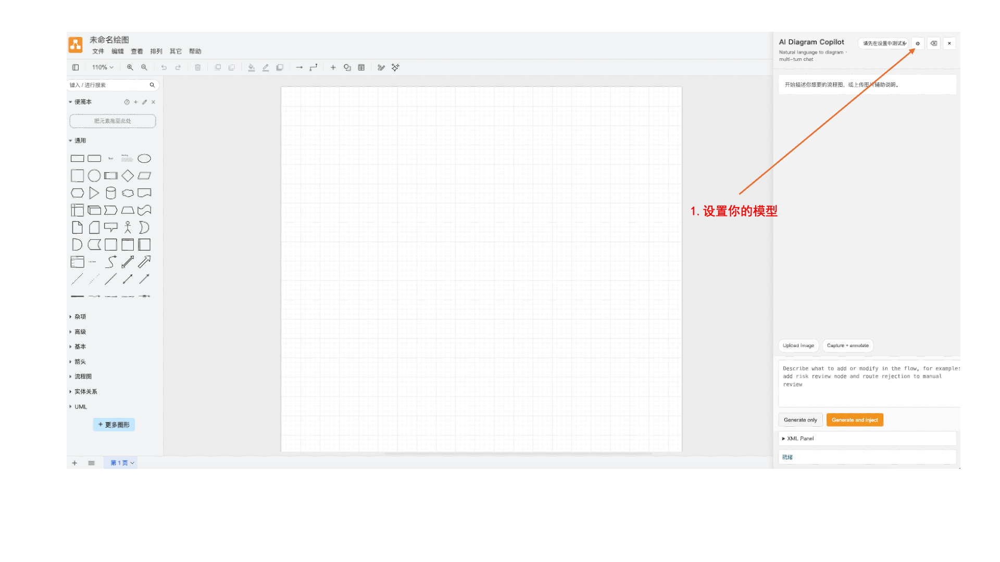
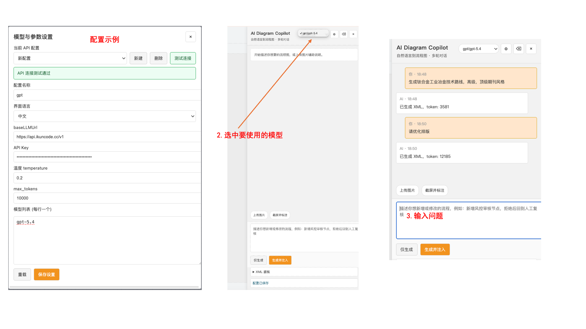
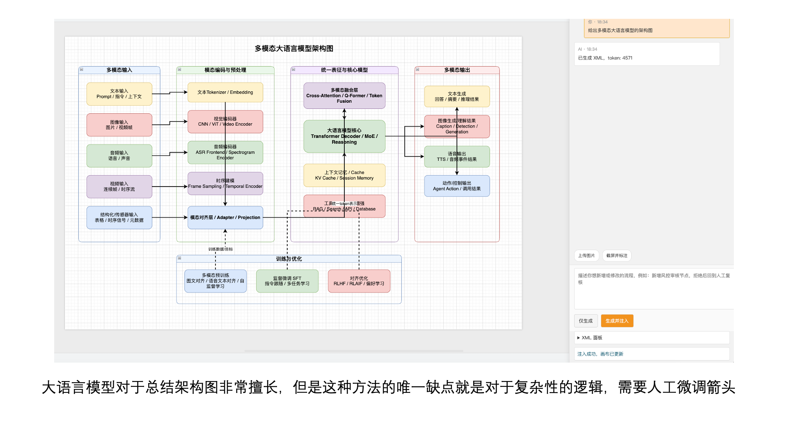
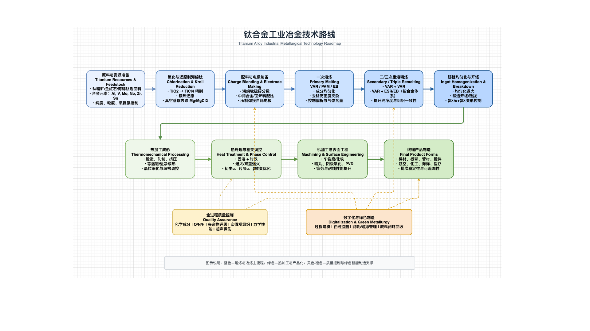
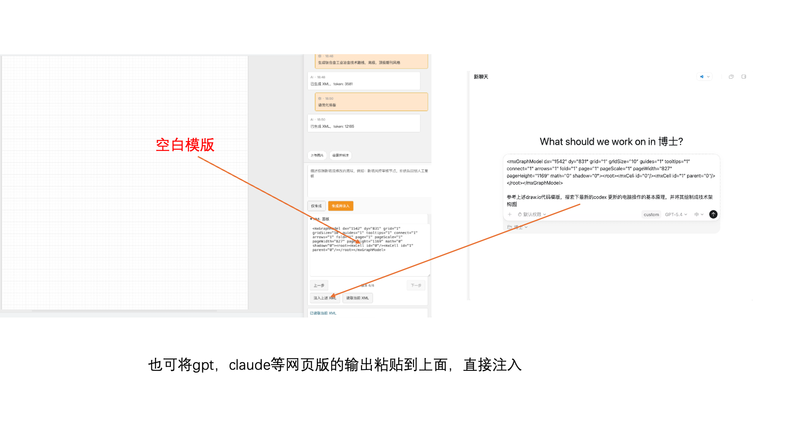

# Draw.io AI Sidebar 宣传文案

这份文案用于对外宣传，包含演示图片与两个版本的帖子内容：

- Reddit 版：更偏海外社区分享语气
- 国内版：更偏中文社区、朋友圈、知识社区或产品发布语气

---

## 演示图片

### 1. 先配置模型

### 2. 选择模型并直接输入需求

### 3. 生成复杂架构图示例

### 4. 生成技术路线图示例

### 5. 也可以直接粘贴 XML 注入 draw.io

---

## Reddit 版

### 标题建议

`I built a Chrome extension that adds an AI sidebar to draw.io, so I can generate and inject diagram XML directly`

### 正文

I’ve been using draw.io a lot for architecture diagrams, flows, and research visuals, and one thing kept bothering me: the actual drawing part is often much slower than the thinking part.

So I made a small Chrome extension that adds an AI sidebar directly inside draw.io.

I know draw.io has also been moving toward official MCP-related workflows recently, and I did pay attention to that.
But after trying similar flows, I still felt they weren’t quite what I wanted.

What I really wanted was a sidebar living inside draw.io itself, where I can iterate quickly without jumping out to GPT, calling a tool, waiting for XML, and then bringing it back manually.
I wanted the feedback loop to stay close to the canvas.

The basic idea is simple:

- I type what I want in plain language
- it generates draw.io XML
- then I can inject it straight into the current canvas

What I found useful is that it’s not just for “generate from scratch”.
I can also use it to iterate on an existing diagram, adjust layout, or paste XML generated by GPT/Claude and inject it directly into draw.io.

Another thing that mattered to me was customization.
I didn’t want the workflow to be tied to a specific model vendor, so I made it work with my own API configuration instead of locking it to one provider.

Current things it supports:

- multi-turn chat inside draw.io
- custom model config
- image upload as extra context
- screenshot + annotation before sending context
- XML panel with injection workflow

It works especially well for:

- architecture diagrams
- flowcharts
- roadmap-style visuals
- first-pass drafts that I want to clean up manually afterward

One thing I noticed while testing is that LLMs are actually pretty good at producing the overall structure for complex diagrams.
They’re still not perfect with fine layout details, but getting a solid first version in seconds is already a big improvement for me.

I added a few screenshots below to show the flow:

**1. Configure the model**

**2. Select a model and enter a prompt**

**3. Example: generated multimodal model architecture**

**4. Example: generated industrial roadmap**

**5. XML can also be pasted in directly and injected**

Still rough in a few places, but it’s already usable for my own workflow.
If you use draw.io a lot, I’d be curious whether this workflow feels useful to you too.

---

## 国内版

### 标题建议

`我做了一个 draw.io 侧边栏插件，想把“描述需求 -> 出图 -> 注入画布”这件事变顺一点`

### 正文

最近我一直在折腾一个自己会高频使用的小工具：给 draw.io 加一个 AI 侧边栏。

起因很简单。
我平时画流程图、架构图、技术路线图的时候，真正耗时间的往往不是“想清楚内容”，而是手动拖框、连线、改布局这些重复操作。

另外，虽然 draw.io 官方最近也在出相关的 MCP 方向能力，我也有关注。
但我自己试下来，总觉得那不是我真正想要的交互方式。

我更想要的是一个直接长在 draw.io 里的侧边栏，让我盯着当前画布快速迭代，而不是先在 GPT 里调用、拿到结果、再回来处理。
对我来说，图就在旁边、修改也在旁边，这个工作流会顺很多。

所以我就做了这个插件，想尽量把流程变成：

- 直接描述我要什么图
- 让模型生成 draw.io XML
- 一键注入当前画布
- 再在现有结果上继续微调

它不是那种“完全替代手工画图”的东西，我自己的定位更像是：
先帮我把第一版骨架搭出来，然后我再继续改。

还有一点我比较在意的是定制化。
我不太希望它被某一家模型厂商绑定死，所以插件支持我自己配 API，用什么模型、接什么服务，我可以自己决定。

目前我自己用下来，比较顺手的地方有这些：

- 侧边栏直接在 draw.io 里，不用来回切页面
- 支持配置自己的模型接口
- 可以多轮对话，继续让它优化已有图
- 支持上传图片、截图标注再发给模型
- 也支持把 GPT、Claude 网页版生成的 XML 直接贴进来注入

我感觉它比较适合下面这些场景：

- 论文配图
- 架构图初稿
- 技术路线图
- 产品流程梳理
- 先快速出一个版本，再自己精修

放几张我实际使用时的截图：

**1. 先配置模型**

**2. 选模型，直接输入需求**

**3. 生成复杂架构图**

**4. 生成技术路线图**

**5. 也可以直接粘贴 XML 注入**

现在这个项目还在持续完善中，有些细节还比较粗，但已经能明显帮我省掉一部分重复劳动了。

如果你平时也常用 draw.io，或者你也觉得“脑子比手快，画图太费时间”，那这个方向可能对你也有点用。

如果你愿意提建议，或者想一起完善这个仓库，我也很欢迎。
