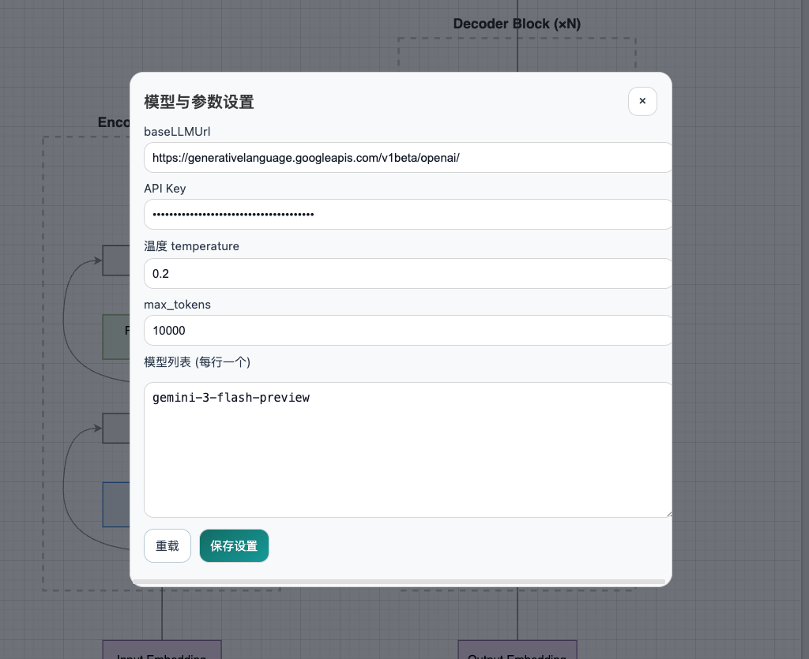

# 一些 bug

1. 截屏并标注功能，应该只截屏画布的部分，也就是 xml 选然后的部分，并且跟随对话上传之后应该清空，而不是每次对话都带着之前截图的信息

2. 当前的模型参数设置，如图:
只能保存一个 baseurl 以及配置项，应该支持多个不同 baseurl api 的配置，并支持给其自定义名称。设置一个测试按钮,支持测试api 连通性

3. 适应浏览器语言，当前的界面是英文的，应该根据用户浏览器的语言设置来适配界面语言，比如中文用户看到中文界面，英文用户看到英文界面等。